# Application Access Policy to App RBAC Toolkit

This toolkit inventories legacy Exchange Online Application Access Policies (AAPs), prepares App RBAC, and provides an optional script for completing one reviewed application migration at a time.

## Why This Migration

- Microsoft identifies Application Access Policies as a legacy mailbox-scoping model and recommends Exchange Online RBAC for Applications for new configurations.
- App RBAC replaces the broad-permission-plus-AAP model with an Exchange application role and resource scope.
- Microsoft has not published a firm AAP retirement date in the cited guidance. Plan and validate the migration rather than assuming an enforcement date.

Microsoft documentation:

- [Role Based Access Control for Applications in Exchange Online](https://learn.microsoft.com/exchange/permissions-exo/application-rbac)
- [Application Access Policies in Exchange Online](https://learn.microsoft.com/exchange/permissions-exo/application-access-policies)

For field definitions and extended background, see [INVENTORY-OUTPUT-GUIDE.md](INVENTORY-OUTPUT-GUIDE.md) and [DETAILED-MIGRATION-GUIDE.md](DETAILED-MIGRATION-GUIDE.md). For a command-by-command lab, see [Application-Access-Policy-Migration-Runbook.txt](Application-Access-Policy-Migration-Runbook.txt).

## Requirements

- PowerShell 7.4 or later.
- ExchangeOnlineManagement **3.6.0 exactly**. Versions 3.7.0 and later are not supported by this toolkit's macOS browser/MFA workflow.
- Microsoft Graph PowerShell 2.0 or later.
- OpenSSL on `PATH` for script 01. Windows does not include OpenSSL by default.
- Appropriate Entra and Exchange administrative roles.

```powershell
Install-Module ExchangeOnlineManagement -RequiredVersion 3.6.0 -Scope CurrentUser
Install-Module Microsoft.Graph.Authentication -Scope CurrentUser
Install-Module Microsoft.Graph.Applications -Scope CurrentUser
```

## The Two Service Principals

Creating an app registration also creates an Entra Enterprise Application. That Enterprise Application is the tenant's Entra service principal.

App RBAC requires Exchange Online to create its own pointer to that existing Entra service principal:

- **Application/client ID:** identifies the application in both systems.
- **Entra service-principal object ID:** the Enterprise Application object ID.
- **Exchange service-principal pointer:** an Exchange object created with both IDs. It is not another Entra application or Enterprise Application.

[](docs/diagrams/legacy-aap.png?raw=1)

[](docs/diagrams/app-rbac.png?raw=1)

On GitHub, select a diagram to open its high-resolution PNG. Click the opened image for actual size, use browser zoom, or pinch to zoom on a touch device.

## Automation Boundary

| Script | Behavior |
|---|---|
| `01-New-LegacyAapLab.ps1` | Creates a disposable legacy AAP test application. |
| `02-Export-AapInventory.ps1` | Read-only inventory and HTML review dashboard. |
| `03-Convert-AapToAppRbac.ps1` | Prepare only: creates/reuses the Exchange pointer and scope, then creates the App RBAC role assignment. |
| `04-Test-GraphMailboxAccess.ps1` | Read-only live `Mail.Read` authorization test for one mailbox. |
| `05-New-AppRbacLab.ps1` | Creates a separate Windows-only native App RBAC lab. |
| `06-Complete-AppRbacMigration.ps1` | Optional single-app Cutover or Cleanup with preview, explicit acknowledgement, validation, and optional rollback. |

Script 03 accepts only `-Phase Prepare`. Script 06 is optional and accepts one App ID plus one phase; it has no inventory loop or bulk mode. The manual commands remain available for administrators who do not want scripted Cutover or Cleanup.

[](docs/diagrams/migration-phases.png?raw=1)

## 1. Test the Process with the Lab App

Choose an allowed mailbox and a denied mailbox. The denied mailbox must not belong to the scope group.

By default, script 01 uses existing recipients. It looks up every authorized and denied address with `Get-Recipient` and stops if any address does not exist. Add `CreateSharedMailboxes = $true` to the parameter block only when you want the script to create missing addresses as shared mailboxes.

Existing mailboxes are never recreated. Authorized mailboxes are added as direct members of the new or reused scope group. The denied mailbox is not added, but the script does not remove it if it was already a member of a reused group; verify that membership before testing.

```powershell
$TenantId = '00000000-0000-0000-0000-000000000000'
$AcceptedDomain = 'contoso.com'
$AllowedMailbox = 'allowed@contoso.com'
$DeniedMailbox = 'denied@contoso.com'

$lab = @{
    TenantId                    = $TenantId
    AcceptedDomain              = $AcceptedDomain
    AuthorizedMailboxAddresses = @($AllowedMailbox)
    DeniedMailboxAddress        = $DeniedMailbox
    AppDisplayName              = 'AAP Migration Lab'
    ScopeGroupName              = 'AAP-Lab-Mailboxes'
    GraphPermissionValue        = 'Mail.Read'
    # CreateSharedMailboxes     = $true
    AuthenticationMode         = 'Browser'
}

./01-New-LegacyAapLab.ps1 @lab
./01-New-LegacyAapLab.ps1 @lab -Execute
```

The first command previews; the second creates:

- An Entra app registration and its Enterprise Application/service principal.
- An OpenSSL certificate, private key, and uploaded public certificate.
- The selected Microsoft Graph application permission with admin consent.
- A mail-enabled security group containing only the allowed mailbox.
- A legacy `RestrictAccess` AAP for the app and group.
- `Output/lab/legacy-lab-state.json` containing the created IDs and paths.

The script also calculates legacy AAP access for the allowed and denied mailboxes. It does not create App RBAC or prove live Graph enforcement.

### Inspect what the lab created and who has access

Load the saved state so the commands use the exact application, policy, and group created by the lab:

```powershell
$state = Get-Content ./Output/lab/legacy-lab-state.json -Raw |
    ConvertFrom-Json
$AppId = $state.Application.AppId
$PolicyIdentity = $state.ApplicationAccessPolicy.Identity
$ScopeGroup = $state.ScopeGroup.PrimarySmtpAddress
```

Show every legacy AAP in the tenant:

```powershell
Get-ApplicationAccessPolicy |
    Format-List Identity, AppId, AccessRight, PolicyScopeGroupId, Description
```

Show this lab application's exact policy:

```powershell
Get-ApplicationAccessPolicy -Identity $PolicyIdentity |
    Format-List Identity, AppId, AccessRight, PolicyScopeGroupId, Description
```

Show the actual allowed mailbox set. For this `RestrictAccess` policy, every direct mailbox member of the scope group is allowed:

```powershell
Get-DistributionGroupMember -Identity $ScopeGroup -ResultSize Unlimited |
    Format-Table DisplayName, PrimarySmtpAddress, RecipientType
```

Recheck every requested authorized mailbox and the denied mailbox:

```powershell
foreach ($mailbox in $state.AuthorizedMailboxes) {
    Test-ApplicationAccessPolicy -AppId $AppId -Identity $mailbox
}

Test-ApplicationAccessPolicy `
    -AppId $AppId `
    -Identity $state.DeniedMailbox
```

Test any other mailbox when you need its effective policy result:

```powershell
Test-ApplicationAccessPolicy `
    -AppId $AppId `
    -Identity 'another-mailbox@contoso.com'
```

`Granted` means the legacy policy allows the application; `Denied` means it blocks the application. The returned `Mailbox` value may be an Exchange object GUID even when the command used an email address.

`Test-ApplicationAccessPolicy` validates Exchange configuration immediately, but a new AAP or group-membership change can take up to two hours to reach the Graph data plane. Wait for propagation, then run the live `Mail.Read` checks separately. Script 04 disconnects Graph first so each run obtains a new app-only token.

```powershell
./04-Test-GraphMailboxAccess.ps1 `
    -TenantId $TenantId `
    -AppId $state.Application.AppId `
    -Mailbox $AllowedMailbox `
    -ExpectedAccess Allowed `
    -CertificatePemPath $state.Certificate.CertificatePemPath `
    -PrivateKeyPath $state.Certificate.PrivateKeyPath

./04-Test-GraphMailboxAccess.ps1 `
    -TenantId $TenantId `
    -AppId $state.Application.AppId `
    -Mailbox $DeniedMailbox `
    -ExpectedAccess Denied `
    -CertificatePemPath $state.Certificate.CertificatePemPath `
    -PrivateKeyPath $state.Certificate.PrivateKeyPath
```

If the allowed mailbox returns `403 ErrorAccessDenied` with `[RAOP] Blocked by tenant configured AppOnly AccessPolicy settings`:

1. Confirm the mailbox appears in `Get-DistributionGroupMember -Identity $ScopeGroup`.
2. Confirm `Test-ApplicationAccessPolicy -AppId $AppId -Identity $AllowedMailbox` returns `Granted`.
3. If the policy or membership is new, wait up to two hours and rerun script 04.
4. If it still fails, list every policy for the App ID and check for an applicable `DenyAccess` policy.

Do not recreate the app, certificate, or mailbox solely because of an RAOP response during the propagation window.

## 2. Export and Review All Applications

```powershell
./02-Export-AapInventory.ps1 `
    -TenantId $TenantId `
    -AuthenticationMode Browser
```

Open the newest `Output/inventory-yyyyMMdd-HHmmss/inventory-review.html`, then review these files in order:

1. `migration-readiness-issues.csv`: blockers and warnings.
2. `application-access-policies.csv`: App ID, policy identity, access type, and scope group.
3. `applications.csv`: app display name and `ServicePrincipalObjectId`. This is the Entra Enterprise Application object ID used by Exchange.
4. `application-permissions.csv`: permission, assignment ID, and recommended Exchange application role.
5. `scope-members.csv`: intended mailbox membership and nested groups.
6. `existing-app-rbac-assignments.csv`: preparation that already exists.

Join the files by `AppId`. Do not prepare wildcard policies, `DenyAccess` policies, ambiguous permissions, unknown owners, or unverified mailbox scopes.

## 3. Prepare the Exchange Objects for Every Approved App

For each reviewed application, create a parameter block with its own App ID, role, scope, and test mailboxes. Run preview and Execute once for that application, then move to the next approved application.

```powershell
$app = @{
    TenantId             = $TenantId
    AppId                = 'APPLICATION-CLIENT-ID'
    ApplicationRoleName  = 'Application Mail.Read'
    EntraPermissionValue = 'Mail.Read'
    ScopeType            = 'ExistingPolicyGroup'
    PositiveMailbox      = 'allowed@contoso.com'
    NegativeMailbox      = 'denied@contoso.com'
    AuthenticationMode   = 'Browser'
}

./03-Convert-AapToAppRbac.ps1 @app -Phase Prepare
./03-Convert-AapToAppRbac.ps1 @app -Phase Prepare -Execute
```

Prepare creates only the missing objects required for the approved mapping:

1. Exchange service-principal pointer to the existing Entra service principal.
2. Exchange Management Scope based on the existing AAP group, unless an approved alternate scope was selected.
3. Exchange application-role assignment over that scope.
4. A migration state file under `Output/migrations/`.

It also checks that the positive mailbox is in scope and the negative mailbox is out of scope. Repeat this reviewed Prepare operation for all approved apps. Do not put Cutover or Cleanup commands in a loop.

After propagation, inspect the prepared objects:

```powershell
Get-ServicePrincipal | Where-Object AppId -eq $app.AppId |
    Format-List DisplayName, AppId, ObjectId, Identity

Get-ManagementRoleAssignment | Where-Object Role -eq $app.ApplicationRoleName |
    Format-Table Name, Role, App, CustomResourceScope

Test-ServicePrincipalAuthorization `
    -Identity $app.AppId -Resource $app.PositiveMailbox |
    Where-Object RoleName -eq $app.ApplicationRoleName

Test-ServicePrincipalAuthorization `
    -Identity $app.AppId -Resource $app.NegativeMailbox |
    Where-Object RoleName -eq $app.ApplicationRoleName
```

Required results are `InScope=True` for the positive mailbox and `InScope=False` for the negative mailbox.

## 4. Migrate One Application

Finish all steps for one App ID before selecting the next application.

### Optional single-app script

Script 06 reads the state created by Prepare, verifies the exact Entra and Exchange objects, and previews by default.

Preview and execute Cutover for one app:

```powershell
./06-Complete-AppRbacMigration.ps1 `
    -TenantId $TenantId `
    -AppId $app.AppId `
    -Phase Cutover

./06-Complete-AppRbacMigration.ps1 `
    -TenantId $TenantId `
    -AppId $app.AppId `
    -Phase Cutover `
    -AcknowledgeSingleAppChange `
    -AcknowledgeExternalLiveValidation `
    -AutoRollbackOnValidationFailure `
    -Execute
```

`-AcknowledgeExternalLiveValidation` means you will run the application's live test separately. To have the script run allowed and denied `Mail.Read` tests instead, replace that switch with `-CertificatePemPath` and `-PrivateKeyPath`, or use `-CertificateThumbprint` on Windows.

After successful live testing and the observation period, preview and execute Cleanup:

```powershell
./06-Complete-AppRbacMigration.ps1 `
    -TenantId $TenantId `
    -AppId $app.AppId `
    -Phase Cleanup

./06-Complete-AppRbacMigration.ps1 `
    -TenantId $TenantId `
    -AppId $app.AppId `
    -Phase Cleanup `
    -AcknowledgeSingleAppChange `
    -AcknowledgeExternalLiveValidation `
    -ObservationValidated `
    -AutoRollbackOnValidationFailure `
    -Execute
```

Cutover removes only the matching broad Entra permission recorded by Prepare. Cleanup removes only the matching legacy AAP. Both retain the App RBAC assignment and write results to the same migration state file.

### Manual option

Use the following commands instead of script 06 when the change must be performed directly.

### Manually remove the matching broad Entra grant

Use the `AssignmentId` from `application-permissions.csv`, then retrieve and display that exact assignment before deletion:

```powershell
Connect-MgGraph -TenantId $TenantId `
    -Scopes Application.Read.All,AppRoleAssignment.ReadWrite.All `
    -ContextScope Process -NoWelcome

$AppId = $app.AppId
$AssignmentId = 'ASSIGNMENT-ID-FROM-APPLICATION-PERMISSIONS-CSV'
$entraSp = Get-MgServicePrincipal -Filter "appId eq '$AppId'" -All |
    Select-Object -First 1
$assignment = Get-MgServicePrincipalAppRoleAssignment `
    -ServicePrincipalId $entraSp.Id -All |
    Where-Object Id -eq $AssignmentId

$assignment | Format-List Id, PrincipalId, ResourceId, AppRoleId
```

Stop if no assignment is returned or its IDs do not match the reviewed inventory. After change approval, remove that one assignment manually:

```powershell
Remove-MgServicePrincipalAppRoleAssignment `
    -ServicePrincipalId $entraSp.Id `
    -AppRoleAssignmentId $assignment.Id `
    -Confirm
```

Disconnect Graph, wait for propagation, and obtain a fresh app-only token. Run script 04 once for the allowed mailbox and once for the denied mailbox. The allowed request must succeed and the denied request must return an authorization denial. Also test the application's normal business operation.

If the denied request succeeds, stop. Check for another broad permission grant, stale tokens, and propagation delay. Do not remove the legacy AAP.

### Manually retire the legacy AAP

After the observation period and application-owner approval, retrieve the exact policy identity from `application-access-policies.csv` and inspect it:

```powershell
$PolicyIdentity = 'POLICY-IDENTITY-FROM-APPLICATION-ACCESS-POLICIES-CSV'
$policy = Get-ApplicationAccessPolicy -Identity $PolicyIdentity
$policy | Format-List Identity, AppId, AccessRight, PolicyScopeGroupId, Description
```

Stop unless the policy App ID and scope match the reviewed application. Remove that one policy manually:

```powershell
Remove-ApplicationAccessPolicy -Identity $policy.Identity -Confirm
```

Repeat the App RBAC configuration tests, live allowed/denied tests, and normal workload test. Then export a fresh inventory and archive it with the change record.

## Testing Rules

These tests answer different questions:

| Test | What it proves |
|---|---|
| `Test-ApplicationAccessPolicy` | Legacy AAP configuration calculation. |
| `Test-ServicePrincipalAuthorization` | App RBAC role and scope calculation. |
| Script 04 or the application's own app-only request | Live data-plane enforcement with an application token. |

Signing into Outlook as a mailbox user uses delegated authorization and does not prove app-only access. Configuration tests also do not replace a fresh-token live test after the broad grant is removed.